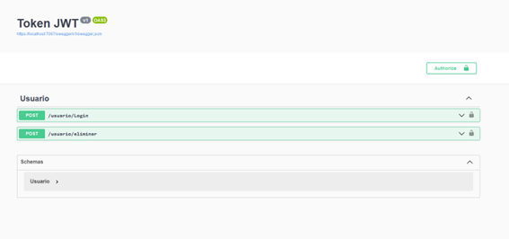
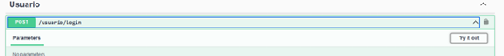
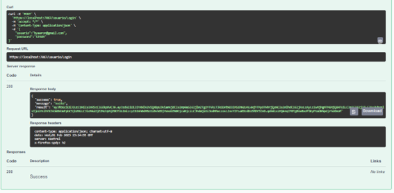
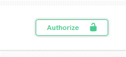
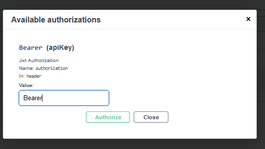
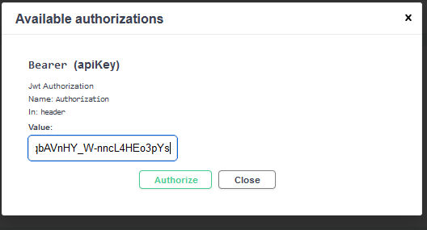
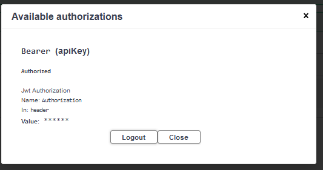
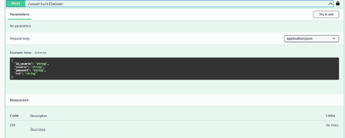
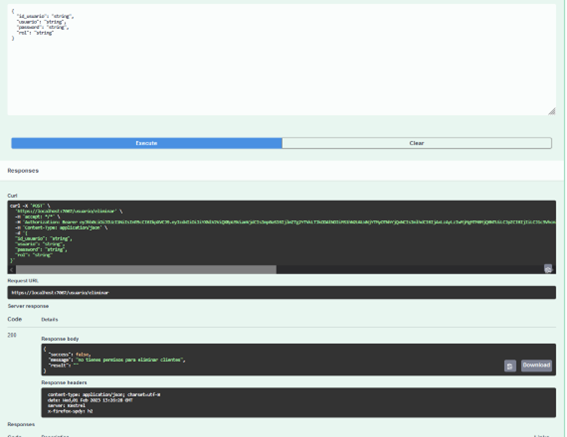
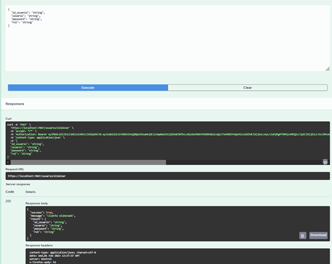

## Generación de Token JWT para inicio de sesión 
### Como Utilizar a Través de la Vista 
#### Lo primero con lo que nos encontramos es una pagin con los dos endpoint permitidos en la app uno es eliminación y el otro es login
<p align="center"></p>

#### Para poder ingresar primero necesitamos posicionarnos en el enpoint requerido en este caso login y presionamos el boton "Try it Out"
<p align="center"></p>

#### En esta area para ingresar  texto ingresamos nuestras credenciales en formato json
<p align="center"></p>

#### Al hacerlo de la manera correcta nos mostrar un mensaje de exito y nos generara un token, debemos copiar el token generado
<p align="center"></p>

#### No posicionamos en el boton "Authorize"  
<p align="center"></p>

#### Para que nuestro token tenga validez por cuestiones de librearia deberemos de colocar la palabra "Bearer" y seguido copiar nuestro token  
<p align="center"></p>

#### Luego de haber colocado Bearer [token] en nuestro campo le damos a authorizar
<p align="center"></p>

#### esto nos permitira ingresar al endpoint de eliminar y abriremos una sesión en la pagina , estas sesiones tienen una duración de 60 minutos 
<p align="center"></p>

#### Nos posicionamos en el endpoint de eliminar 
<p align="center"></p>

#### Presionamos el boton de "try it Out" y luego el de ejecutar esto nos generara un resultado dependiendo de nuestro rol de usuario, como este usuario no tiene los permisos necesarios no nos dejara ejecutar la función
<p align="center"></p>

#### Probamos con un Usuario que si tiene los permisos necesarios y si la operación ha sido resuelta de manera satisfactoria se mostrara un mensaje de "usuario eliminado"
<p align="center"></p>

### Configuraciones en el código 
#### en este bloque de codigo podemos configurar la ruta a ala que accederan los usuarios y tambien en el atributo Key podemos configurar nuestra llave es recomendable que sea medianamente larga ya que de ser corta generara un error en el encoding, este bloque se encuentra en la clase appSetting.json
```C#
  //configuracion para nuestro proyecto y generación de la llave secretra para la generacion del token 
  "AllowedHosts": "*",
  "Jwt": {
    "Key": "softwareA23@.QQQQQQQQQQQQQQQ",
    "Issuer": "https://localhost:7067",
    "Audience": "https://localhost:7067",
    "Subject": "baseWebApiSubject"
  }
}
```
####
Este es el modelo de usuario con el que trabajamos se encuentra en la clase Usuario.cs
```C#
   public class Usuario
    {
        // modelo de usuario 
        public string id_usuario { get; set; }
        public string usuario { get; set;}
        public string password { get; set;}

        public string rol { get; set; }

        // db temporal para pruebas sin bd 
        public static List<Usuario> DB() {

            var list = new List<Usuario>()
            {
                new Usuario
                {
                    id_usuario = "1",
                    usuario= "byron@gmail.com",
                    password="12345",
                    rol="admin"
                },
                new Usuario
                {
                    id_usuario = "2",
                    usuario= "byaaron@gmail.com",
                    password="12345",
                    rol="cliente"
                },
                new Usuario
                {
                    id_usuario = "3",
                    usuario= "bysssron@gmail.com",
                    password="12345",
                    rol="admin"
                }
            };
            return list;
            }
    }
```

####
con este metodo podemos validar el endpoint generado de cada usuario a través del uso de ClaimsIdentity, lo que haces es ver si el identity.claims.Count() es igual a 0, de ser asi retornara que se verifique el token , de no ser asi validara el token con el del usuario que se desea ingresar y si son iguales mostrara un mensaje  de verificado, este bloque de codigo se encuentra en Jwt.cs
```C#
   public static dynamic validarToken(ClaimsIdentity identity)
        {
            try
            {
                if (identity.Claims.Count() == 0)
                {
                    return new
                    {
                        success = false,
                        message = "Verificar Token Valido",
                        result = ""
                    };

                }
                var id = identity.Claims.FirstOrDefault(x => x.Type == "id").Value;
                Usuario usuario = Usuario.DB().FirstOrDefault(x => x.id_usuario == id);
                return new
                {
                    success = true,
                    message = "Verificado",
                    result = usuario
                };

            } 
            catch (Exception ex)
            {


                return new
                {
                    success = false,
                    message = "catch:"+ ex.Message,
                    result = ""

                };
            }
        }
    }
```
####
con este enpoint que es un Post podremos logearnos con el token, por lo que se nos solicita un usuario y una contraseña, tenemos dos opciones una es para db y otra es de una lista interna de usuarios, al hacer esto y si las credenciales estan correctas , se creara el token y podremos usarlo para poder acceder a otras funciones, este bloque de codigo se encuentra en UsuarioController.cs
```C#
    // cadena de conexion a una db 
        //static string cadena = "Data Source=(local);Initial Catalog=DB_ACCESO;Integrated Security=true";

        [HttpPost]
        [Route("Login")]
        public dynamic Login([FromBody]Object optData)
        {
            var data = JsonConvert.DeserializeObject<dynamic>(optData.ToString());
            string user = data.usuario.ToString();
            string pass = data.password.ToString();

           // decomentar para una conexion a una db 
           /* 
           Usuario user2 = new Usuario();
            using (SqlConnection cn = new SqlConnection(cadena))
            {
                SqlCommand cmd = new SqlCommand("sp_Validar_Usuario", cn);
                cmd.Parameters.AddWithValue("@pUsuario", user);
                cmd.Parameters.AddWithValue("@pPassword", pass);
                cmd.CommandType = System.Data.CommandType.StoredProcedure;
                cn.Open();
                data = Convert.ToInt32(cmd.ExecuteScalar().ToString());
                user2 = data;
            }
            */

            Usuario usuario = Usuario.DB().Where(x=>x.usuario == user && x.password == pass).FirstOrDefault();

            if(usuario == null)
            {
                return new
                {
                    success = false,
                    message = "credenciales incorrectas",
                    result = ""
                };
            }
            var jwt = _configuration.GetSection("Jwt").Get<Jwt>();
            var claims = new[]
            {
                new Claim(JwtRegisteredClaimNames.Sub, jwt.Subject),
                new Claim(JwtRegisteredClaimNames.Jti, Guid.NewGuid().ToString()),
                new Claim(JwtRegisteredClaimNames.Iat, DateTime.UtcNow.ToString()),
                new Claim("id",usuario.id_usuario),
                new Claim("usuario",usuario.usuario)
            };

            var key = new SymmetricSecurityKey(Encoding.UTF8.GetBytes(jwt.Key));
            var singIn = new SigningCredentials(key, SecurityAlgorithms.HmacSha256);

            var token = new JwtSecurityToken(
                    jwt.Issuer,
                    jwt.Audience,
                    claims,
                    expires: DateTime.Now.AddMinutes(60),
                    signingCredentials: singIn
                    

                );
            return new
            {
                success = true,
                message = "exito",
                result = new JwtSecurityTokenHandler().WriteToken(token)
            };
        }
```

### Rendimiento y Escalabilidad 

#### esta manera de tokens es muy usado actualmente, el rendimiento es bueno , pero si nos queremos proteger de situaciones donde su principal forma de saturar nuestra capacidad de procesamiento seria colocando un [Authorize] encima de cada endpoint que se quiera proteger y no sea abierto a todo el publico, de esta manera nos podemos proteger en cierta medida en contra de este tipo de acciones y mejoraremos nuestro rendimiento , la escalabilidad es bastante buena llegado al punto que la mayoria de proyectos que hay actualmente utiliza este protocolo de generaciónd e token en JWT debido a su alto indice de fiabilidad y su rapida implementación en cualquier endpoint u eveneto que pueda realizar un usuario.

### Consultas SQL 

```sql
/* Consulta de mas vendido */
SELECT articulo.nombreArt, SUM(detalle_venta.cantidad) as cantidad
    FROM detalle_venta JOIN articulo ON detalle_venta.id_articulo = articulo.idArticulo
    GROUP BY articulo.idArticulo
    ORDER BY SUM(detalle_venta.cantidad) DESC LIMIT 1;

	/* Consulta más Facturado */ 
SELECT SUM(v.total) AS Total,
		MONTHNAME(v.fecha) AS Mes
FROM venta v 
GROUP BY Mes;


insert into productos(nombre,cantidad)
values('prod2',10)
	/* Categoría con más Productos  */ 
select top 1 nombre,cantidad from productos
order by cantidad desc 


	/* Utilizando tablas de referencia cruzada mostrar el producto y día de la semana en
que más se vende */ 

select p.nombre , d.dia from detalle p
inner join dia_semana d
on p.id_dia = d.id_dia
order by total desc 

```

